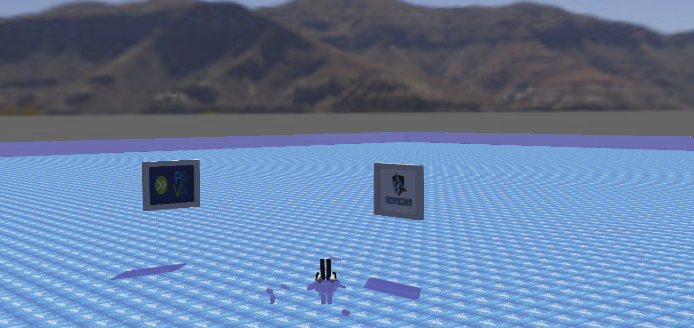

# Aqua Mind ROUV Prototype

A compact Remotely Operated Underwater Vehicle (ROUV), developed as a one-day hackathon prototype under the concept of **Aqua Mind**, demonstrates how an underwater robot can perform debris cleaning and data analysis. This simulation runs in the open-source [Webots](https://cyberbotics.com) environment, allowing the vehicle to move on the water’s surface and dive below it.

## Features

- **Keyboard Controls**  
  - **Arrow Keys:** Move forward, backward, turn left, and turn right.  
  - **W / S Keys:** Float (ascend) or dive (descend).  

- **Onboard Camera**  
  - A front-mounted camera provides real-time visual feedback of the environment.

## Demo

 [Click here to view the demo video](video/demo.mp4)

## Acknowledgments

This design builds on the `.wbt` file from the [Webots-ROV-simulation repository](https://github.com/achintha96/Webots-ROV-simulation). Special thanks to the original project for supplying the open-source foundation that made this prototype possible.
